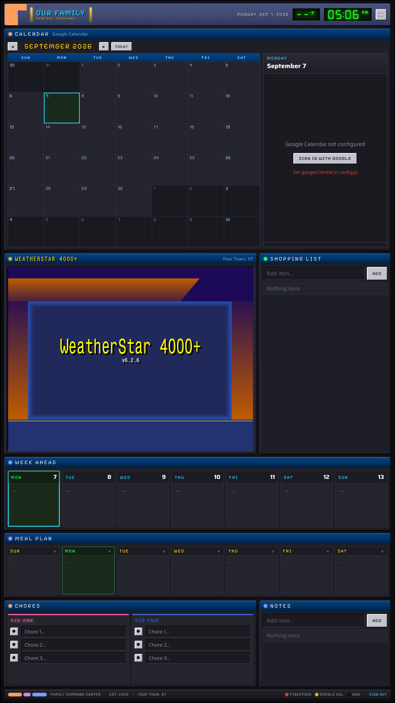
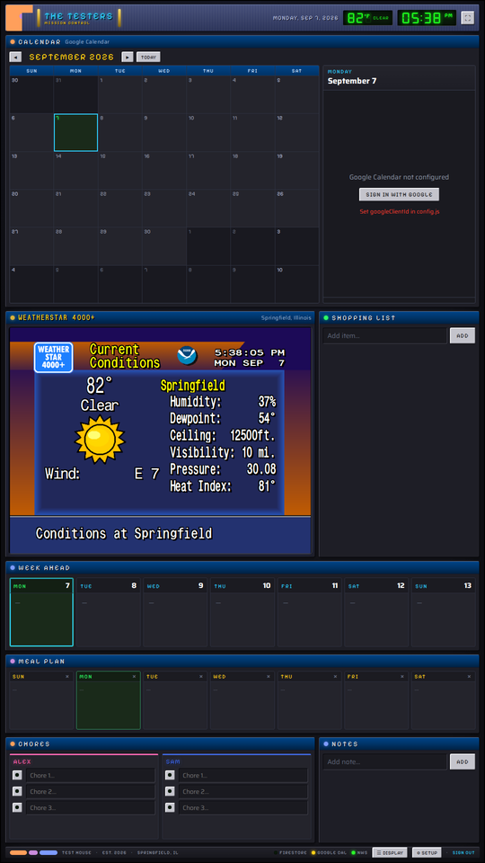
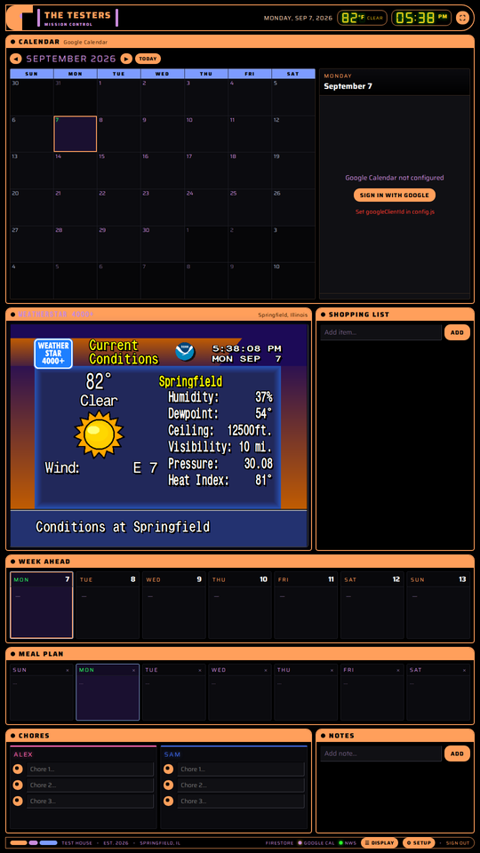
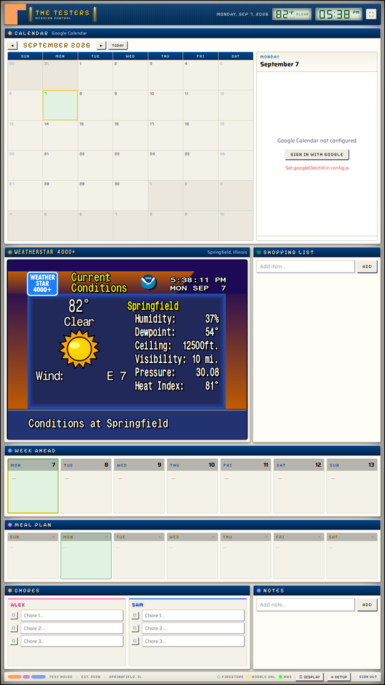
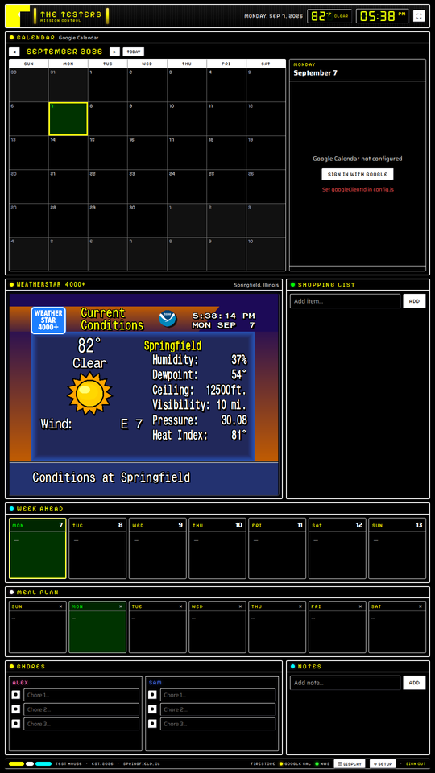

# Free Family Planner

A wall-display family command center: Google Calendar, a week-ahead strip, a live
**WeatherStar 4000+** panel, shopping list, notes, weekly meal plan and a chore board for the
kids. Built for a tablet or TV mounted on the kitchen wall, in portrait or landscape.

No framework, no build step for the app itself: plain HTML, CSS and ES-module JavaScript on a
fixed design canvas (1080×1920 portrait / 1920×1080 landscape) that scales to whatever the
display is, so it looks the same on a 32" panel, a phone, or a laptop.



Retro hi-fi styling: beveled panels, LCD readouts, pixel headings, and a real WeatherStar
4000+ (the 90s cable-TV local weather computer, via the excellent
[ws4kp](https://github.com/netbymatt/ws4kp) simulator) running in the corner.

## What it uses

| Piece | Backed by | Notes |
|---|---|---|
| Calendar, week ahead, add/edit/delete events | a **local family calendar** (no account), any **iCal/ICS feeds** (school, sports, iCloud, Outlook — read-only), and/or **Google Calendar** (OAuth in the browser) | all shown together, colour-coded; US holidays overlaid with Google |
| Shopping list, notes, meals, chores | your choice: **self-hosted sync store** (no cloud), Firebase Firestore, or this-device-only | edits sync between the wall and your phone in the first two |
| WeatherStar 4000+ | bundled ws4kp 6.2.6 in kiosk mode; pick which screens rotate | National Weather Service data, no API key. Outside the US the panel becomes an Open-Meteo conditions + 5-day card in the same retro look |
| Outside temp in the header | api.weather.gov | no API key |
| Login gate | a tiny PHP session + password hash | keeps the page private on a public web server |

Everything runs in the browser. There are two ways to run it:

- **Local host** — `python3 tools/serve.py` on any machine (the display itself, a Pi, a NAS,
  your laptop). No PHP, no login page, nothing exposed to the internet.
- **Public web host** — upload `web/` to any PHP-capable host; a small PHP session + password
  hash keeps the page private so the family can open it from anywhere.

## Setup

### 1. Data store — pick one in the ⚙ wizard
- **Self-hosted (default)**: a small JSON document store on the same server that serves the page —
  `web/api/db.php` on a PHP host (file under `includes/data/`, which the web server must be able to
  write) or built into `tools/serve.py` (`data/planner.json`; a volume in the Docker image). Phones and
  the wall stay in sync, nothing leaves your server, no account needed.
- **Firebase Firestore**: create a Firebase project, add a **Web app**, enable **Firestore**, paste the
  web config into the wizard. The app talks to Firestore anonymously, so lock the rules down to what
  you are comfortable with (the login gate protects the *page*, not the database). Collections used:
  `notes`, `shopping`, `events`, and the documents `settings/weeklyMeals`, `chores/<kidId>`.
- **This device only**: everything in the browser's storage. Zero setup, no sync.

### 2. Calendars
The wizard's Calendars step: the local family calendar is on by default; add iCal/ICS feed URLs
(iCloud public calendar, Google "secret address in iCal format", Outlook publish, school/sports
"subscribe" links — use `https://`, not `webcal://`); Google is optional.

#### Google Calendar (optional, OAuth)
1. In Google Cloud Console, enable the **Google Calendar API**.
2. Create an **OAuth 2.0 Client ID** of type *Web application*; add your site origin
   (e.g. `https://example.com`) to *Authorized JavaScript origins*.
3. Put the client ID in `web/config.js`. The first load on a device shows a *Sign in with
   Google* button; after that, sign-in is silent on refresh.

### 3. Site config — the ⚙ Setup wizard
Open the page and the **⚙ Setup** wizard walks you through family name, kids, location (with a
town search and an NWS test), Firebase (paste the snippet, test the connection) and Google
(client ID check). It opens by itself on a fresh install and is always available from the
status bar. It writes `web/config.js` on the server when it can (hosted PHP install, or
`tools/serve.py`); on a static host it keeps the settings in the browser and offers a
`config.js` download to drop next to `app.html`.

Prefer a file? `cp web/config.example.js web/config.js` and edit it — same keys.

For the hosted install also create the login:
```sh
cp web/includes/auth_config.example.php web/includes/auth_config.php
php -r 'echo password_hash("your-password", PASSWORD_DEFAULT), PHP_EOL;'   # paste into auth_config.php
```
Both files are gitignored. `config.js` is served to the browser (Firebase web keys and OAuth
client IDs are public identifiers by design); `auth_config.php` is never served. For the wizard to
save on a hosted install, the web server user must be able to write `web/config.js`.

### 4. WeatherStar 4000+ bundle
```sh
tools/build-ws4kp.sh          # clones netbymatt/ws4kp v6.2.6, builds it, drops it in web/ws4kp/
```
Needs Node.js. The script patches two root-relative paths in the ws4kp bundle so it can run
from a subfolder. If you keep your own ws4kp clone, point `WS4KP_REPO` at it to skip the clone.

### 5a. Run it locally
```sh
python3 tools/serve.py                # opens http://localhost:8765/
python3 tools/serve.py --host 0.0.0.0 # reachable from other devices on your LAN
```
Or with Docker (builds the WeatherStar bundle for you): `docker compose up -d`.
Skip `auth_config.php` for this mode — there is no login gate. Google OAuth only trusts
`http://localhost` or an `https://` origin, so sign in to Calendar on the display device
itself via localhost (Firestore, WeatherStar and the NWS temp work from any origin).
Step-by-step guides for an Android/Fire tablet, a Raspberry Pi kiosk and Docker on a home
server are in [docs/kiosk/](docs/kiosk/README.md); a systemd unit is in `tools/systemd/`.

### 5b. Or deploy to a web host
Upload the `web/` folder to your host, or use the rsync helper:
```sh
cp deploy.env.example deploy.env && $EDITOR deploy.env
./deploy.sh
```
Open the URL, sign in, then on the wall device open the page and tap the ⛶ button for
fullscreen. A kiosk browser on Android/Fire tablets works well; the login cookie lasts 7 days.

### Local preview
```sh
cd web && python3 -m http.server 8765 --bind 127.0.0.1   # open http://127.0.0.1:8765/app.html
```
Firestore, NWS and WeatherStar work locally; Google sign-in only works on an authorized origin.

## Display settings
The **☰ Display** button (status bar) opens per-screen settings saved in that browser: show/hide
and reorder panels, chores per kid, week start, 12/24-hour clock, °F/°C, force portrait or
landscape, and a night-dim schedule (any touch wakes the screen for a minute). Different screens in
the house can be arranged differently.

## Themes
Four looks, chosen per screen in ☰ Display: **Hi-Fi** (default), **LCARS**, **Paper** (light) and
**High contrast**. A theme is one block of CSS token overrides — see `docs/roadmap/themes.md` to
add your own.

| Hi-Fi | LCARS | Paper | High contrast |
|---|---|---|---|
|  |  |  |  |

## Layout
Portrait, top to bottom (default order — change it in ☰ Display): header (date · outside temp · clock) → calendar month grid with a
day pane → WeatherStar beside the shopping list → week ahead → meal plan → chores beside notes
→ status bar (Firestore / Google Calendar / NWS LEDs, sign-out). Landscape re-flows the same
panels into two columns. Both grids live in `web/assets/css/planner.css`; the canvas scaler is
`fitCanvas()` in `web/assets/js/planner.js`.

## Files
```
web/                 everything that gets deployed
  index.php          session gate → app.html
  auth.php           sign-in page
  app.html           the app shell
  assets/css|js|fonts
  config.js          YOUR site config (gitignored) — config.example.js is the template
  includes/          auth_config.php (gitignored) — auth_config.example.php is the template
  ws4kp/             generated by tools/build-ws4kp.sh (gitignored)
tools/build-ws4kp.sh
deploy.sh, deploy.env.example
```

## Roadmap
See [ROADMAP.md](ROADMAP.md) — setup menu, in-app configuration, themes, more calendar and data
backends, kiosk install guides. Work happens on `feat/*` branches with a draft PR per feature.

## Credits
- [WeatherStar 4000+ (ws4kp)](https://github.com/netbymatt/ws4kp) by Matt Walsh — MIT.
- Fonts: [Saira](https://fonts.google.com/specimen/Saira), [Pixelify Sans](https://fonts.google.com/specimen/Pixelify+Sans)
  and [DSEG7](https://github.com/keshikan/DSEG) — SIL Open Font License; Star4000 — from ws4kp.
- Weather data: National Weather Service (api.weather.gov).

## License
GPL-3.0 — see [LICENSE](LICENSE).
